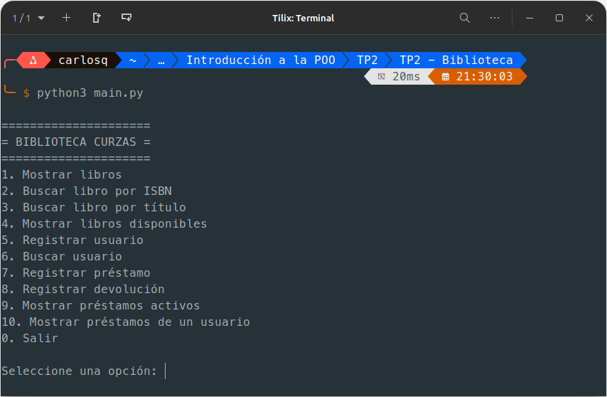
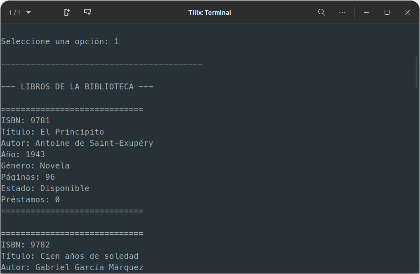
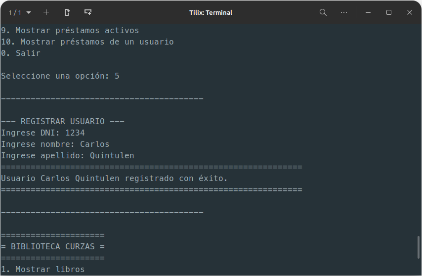
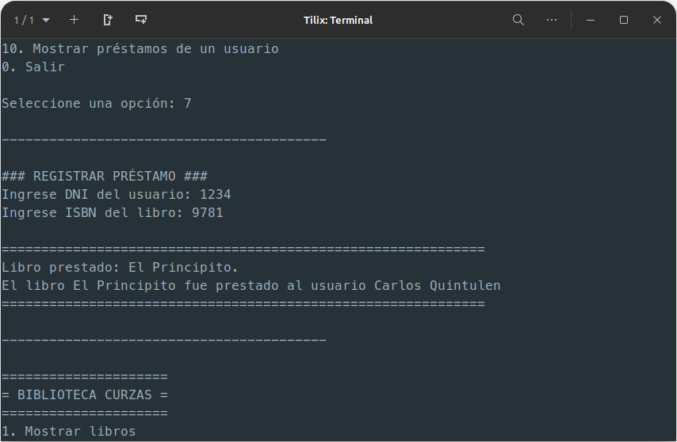
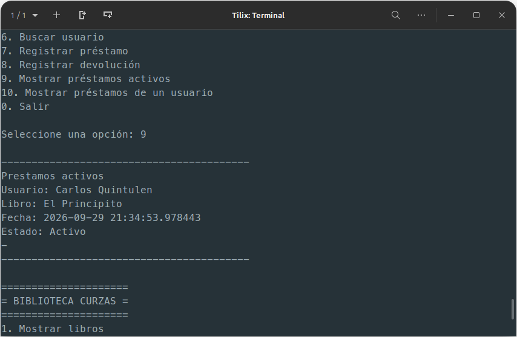
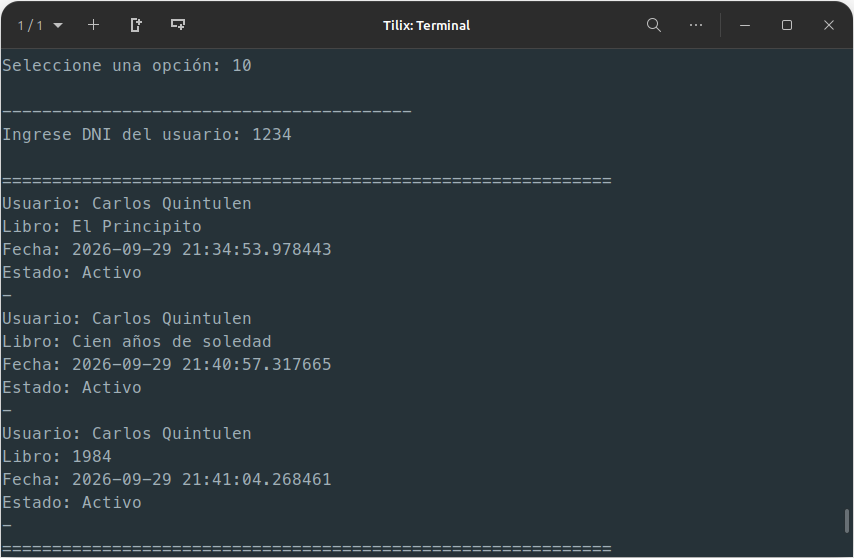

# TRABAJO PRÁCTICO N°2
## INTRODUCCIÓN A LA PROGRAMACIÓN ORIENTADA A OBJETOS

    Alumno: Carlos Quintulen
    Docente: Eduardo Guerra, Julian Diaz Varela
    Fecha: 30-09-2026

1. Análisis de clases:
    - Clase Biblioteca: 
        - Atributos:
            - nombre
            - coleccion_libros
            - coleccion_usuarios
            - coleccion_prestamos
        - Métodos:
            - prestar_libro
            - mostrar coleccion de libros
	        - mostrar libros disponibles
	        - agregar libro a la colección
	        - mostrar coleccion usuario
	        - agregar usuario a la colección
	        - mostrar coleccion de prestamos activos
	        - buscar libro por isbn
	        - buscar libro por nombre
	        - buscar usuario por dni
	        - devolver libro
        	- motrar prestamos de un usuario
    - Clase Usuario:
        - Atributos:
        	- dni
	        - nombre
	        - apellido
      	- Métodos:
	        - mostrar info
    - Clase Préstamo:
      	- Atributos:
	        - usuario
	        - libro
	        - fecha_prestamo
	        - estado_prestamo
     	- Métodos:
	        - consultar usuario
	        - consultar libro
	        - consultar fecha_prestamo
	        - consultar estado_prestamo 
	        - devolver prestamo
2. Relaciones entre objetos
    - Biblioteca — Libro 
    - Biblioteca — Usuario 
    - Biblioteca — Prestamo 
    - Prestamo — Usuario 
    - Prestamo — Libro

    1. Biblioteca-Libro: Uno a muchos, ya que la biblioteca tiene muchos libros y un libro puede estar una vez en la biblioteca.
    1. Biblioteca-Usuario: Uno a muchos, ya que una biblioteca puede tener muchos usuarios pero cada usuario está una sola vez en la biblioteca.
    1. Biblioteca-Préstamo: Uno a muchos, ya que la biblioteca tiene muchos prestamos y un préstamo pertenece a una biblioteca
    1. Usuario-Préstamo: Uno a muchos, ya que un usuario puede solicitar muchos préstamos pero un préstamo le pertenece a un usuario
    1. Libro-Préstamo: Uno a muchos, un libro puede ser prestado muchas veces pero un préstamo de un libro solo uno por vez

### BIBLIOTECA-LIBRO:
1) Las relaciones que participan son una de Biblioteca y muchos de libros.
2) La clase biblioteca necesita conocer a libro, pero libro no necesita conocer a biblioteca
3) Si ambos existen por su cuenta ya que un libro se agrega a la biblioteca, pero si la biblioteca no existe mas el libro se puede agregar a otra biblioteca
4) Biblioteca administra la colección de libros
5) Relación de agregación ya que un libro se agrega a la biblioteca, a la colección de libros.

### BIBLIOTECA-USUARIO:
1) Las relaciones que participan son uno de Biblioteca y muchos Usuarios.
2) Biblioteca necesita conocer a Usuario.
3) Si ambos existen por su cuenta, la clase usuario se crea primero, y luego se agrega a la clase biblioteca, a la colección de usuarios
4) Biblioteca administra la colección de usuarios.
5) Relación de agregación ya que un usuario se crea y luego se agrega a la colección de usuarios de biblioteca

### BIBLIOTECA-PRÉSTAMO:
 1) Las relaciones que existen son uno de Biblioteca y muchos de Préstamo.
 2) Biblioteca necesita conocer y utilizar a Préstamo.
 3) Si ambos existen por su cuenta, un préstamo se crea y luego se agrega a la colección de  préstamos.
 4) Biblioteca administra a la colección de préstamos.
 5) Relación de Composición porque un préstamo dentro de biblioteca.

### PRÉSTAMO-USUARIO:
 1) Las relaciones que existen son uno de Préstamo y muchos de Usuarios.
 2) Préstamo necesita conocer a Usuario.
 3) Ambos pueden existir de manera independiente.
 4) En este caso ninguno administra al otro
 5) Relación de Asociación, ya que préstamo guarda una referencia de la clase  usuario

### PRÉSTAMO-LIBRO:
 1) Las  relaciones que existen son uno de Libro y muchos de Préstamo.
 2) Préstamo necesita conocer a Libro.
 3) Ambos pueden existir de manera independiente.
 4) Ninguno administra al otro
 5) Préstamo guarda una referencia a Libro, es una relación de Asociación.

---
*3, 4, 5 y 6 resueltos en código*
---
7. Pruebas.

    Menú:

    

    Libros disponibles:
    
    
    
    Prestamos Activos:
    Para ver los prestamos activos sin devolver, primero hay que registrar un usuario y luego registrar un préstamo.
    
    
    
    
    
    Ahora si podemos mostrar los préstamos activos
    
    
    
    Préstamo de un usuario:
    
    Para probar esta opción registre un nuevo usuario (ana perez, como en el ejemplo), y más préstamos al primer usuario
    
    

​	 .png)

8. Multiplicidad
·	[Uno a Muchos] - Una biblioteca pude tener muchos libros
·	[Uno a Muchos] - Una biblioteca puede tener muchos usuarios
·	[Uno a Muchos] - Una biblioteca puede registrar muchos préstamos
·	[Uno a Muchos] - Un usuario puede realizar varios préstamos
·	[Uno a muchos] - Un libro puede aparecer en varios prestamos a lo largo de tiempo
·	[Uno a Uno] - Un libro y un usuario intervienen en un préstamo determinado

**Preguntas Conceptuales:**
1.	Un objeto necesita saber de la existencia del otro para poder cumplir con su función
2.	Entre biblioteca y libro existe una relación de uno a muchos, es decir una biblioteca puede tener muchos libros, pero un libro puede estar una vez en la biblioteca.
 Además es una relación de agregación donde el libro se crea fuera y se agrega a la  clase  Biblioteca.
3.  Entre Usuario y Biblioteca existe una relación de uno a muchos, donde un usuario 
puede ingresar en una biblioteca y una Biblioteca tiene muchos usuarios. Es una  relación de agregación donde se crea al usuario afuera y se agrega y almacena en  la clase biblioteca. Ambas clases existen de forma independiente
4.  Préstamo necesita relacionarse con un objeto usuario y un objeto libro porque  necesita consultar el estado de disponibilidad de un libro, es decir si esta activo o  no, y necesita consultar que usuario posee el préstamo de un libro, para devolver  dicha información.
5.  Ambas son relaciones una a muchos, la diferencia es que en préstamo – libro el  préstamo se relaciona una vez, es decir, un libro se presta una vez. 
Y en usuario – préstamo, en préstamo la relación es muchos, es decir, un usuario  puede obtener muchos préstamos
6.  Porque se podría seguir agregando libros a la colección sin pasar por la clase  Biblioteca y sería un error.
7.  En el TP1 había una sola clase (Libro), y todo el trabajo de buscar, filtrar y mostrar  información estaba escrito directamente en main.py, mezclado con los menús.  Además, cada libro existía por su cuenta, sin relación con los demás. En el TP2, en  cambio, aparecieron tres clases nuevas (Usuario, Prestamo y Biblioteca), y toda  esa lógica se organizó dentro de Biblioteca, dejando a main.py mucho más simple:  solo pide datos y muestra resultados. La diferencia principal es que ahora los  objetos no están aislados, sino que se comunican entre sí para resolver el  problema en conjunto — por ejemplo, un préstamo conoce al usuario y al libro  involucrados, y la biblioteca administra todo eso de forma ordenada.

